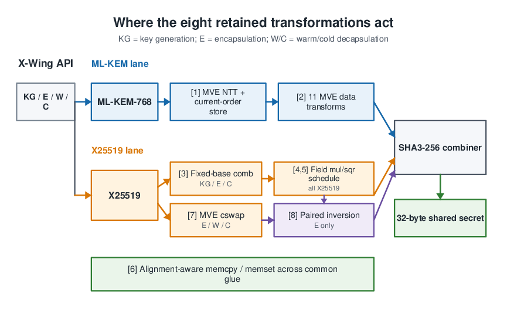
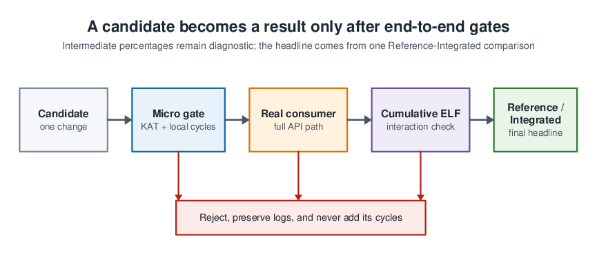
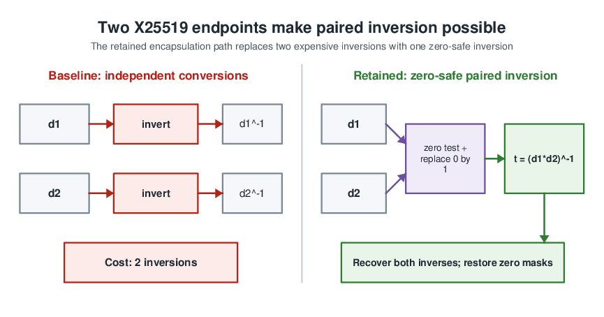
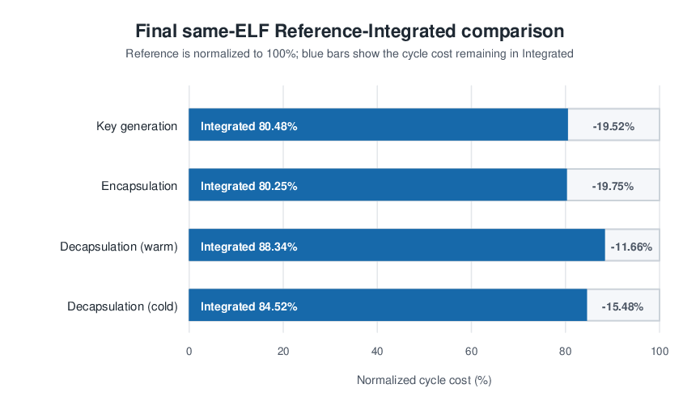

# Cortex-M85 X-Wing 신규 LNCS 원고 초안

> 상태: 새 논문의 논리 골격을 잡기 위한 한국어 Markdown 초안  
> 원칙: 기존 main.tex의 문장과 절 구성을 그대로 옮기지 않는다.  
> 주 결과: 최적화 전 기준 구현과 여덟 가지 최적화를 적용한 최종 통합 구현을 하나의 실행 파일에서 직접 비교한 값만 전체 성능으로 사용한다.  
> 별도 진단 결과: 각 최적화가 어디에서 효과를 냈는지 설명하는 자료로만 사용하며 서로 더하지 않는다.

---

## 0. 이 논문이 전달할 한 문장

기존의 ML-KEM 및 X25519 구현 기법을 Cortex-M85의 M-profile Vector Extension(MVE), 명령 발행 구조, 레지스터와 메모리 제약에 맞춰 X-Wing API 전체에 통합하였다. 최적화 전 기준 구현과 최종 통합 구현을 하나의 실행 파일에서 비교한 결과, 키생성 19.52%, 캡슐화 19.75%, 확장 키를 재사용한 역캡슐화 11.66%, 32-byte seed의 키 확장까지 포함한 역캡슐화 15.48%의 cycle 감소를 얻었다.

이 논문의 핵심은 새 암호 primitive의 발명이 아니다. 핵심은 다음 세 가지다.

1. ML-KEM과 X25519의 서로 다른 병목을 Cortex-M85에 맞게 함께 조정한 통합 설계
2. X-Wing의 데이터 흐름을 이용한 MVE 조건부 교환 및 두 X25519 출력의 역원 계산을 한 번으로 묶는 batch inversion 적용
3. 유망해 보이는 개별 함수 최적화도 전체 API에서 다시 측정하여 채택하거나 폐기한 검증 절차

---

## 1. LNCS 전체 흐름과 권장 분량

| 순서 | LNCS 절 | 독자가 이 절에서 얻어야 하는 답 | 권장 분량 |
|---|---|---|---:|
| 앞부분 | 제목·초록·키워드 | 무엇을 했고 최종적으로 얼마나 개선했는가? | 0.5쪽 |
| 1 | 서론 | 왜 개별 함수의 최적화뿐 아니라 X-Wing 전체 최적화가 필요한가? | 1.2쪽 |
| 2 | 배경과 문제 정의 | X-Wing, ML-KEM, X25519, Cortex-M85가 어떻게 연결되는가? | 1.5쪽 |
| 3 | 통합 최적화 설계 | 여덟 가지 최적화를 ML-KEM·X25519·공통 메모리 연산에 어떻게 적용했는가? | 3.0쪽 |
| 4 | 평가 방법 | 무엇을 기준선으로 삼고 어떻게 공정성과 정확성을 보증했는가? | 1.5쪽 |
| 5 | 결과 | 최종 통합 효과, 개별 기여, 자원비용은 얼마인가? | 3.0쪽 |
| 6 | 한계 | 이 결과를 어디까지 일반화할 수 있는가? | 0.7쪽 |
| 7 | 결론 | 무엇을 확인했고 무엇을 주장하지 않는가? | 0.5쪽 |
| 뒤부분 | 감사의 글·참고문헌 | 재현 자료와 선행연구 연결 | 별도 |

본문은 약 12쪽을 목표로 하고, 참고문헌을 포함해 14쪽 안팎으로 맞추는 구성이 적절하다. 실제 투고처의 page limit가 더 짧다면 한계 절을 압축하고 개별 기여 표를 부록으로 이동한다.

### 논문의 이야기 순서

~~~
개별 ML-KEM/X25519 함수가 빨라져도
                 ↓
X-Wing 전체가 같은 비율로 빨라진다는 보장은 없다
                 ↓
먼저 X-Wing의 각 API 연산에서 병목과 적용 위치를 찾는다
                 ↓
ML-KEM 2개 + X25519 5개 + 공통 메모리 1개를 통합한다
                 ↓
개별 함수 → 각 API 연산 전체 → 통합 구현 순서로 검증한다
                 ↓
최적화 전 기준 구현과 최종 통합 구현을 하나의 실행 파일에서 직접 비교한다
                 ↓
최종 개선과 함께 개별 함수의 이득이 전체 API에서 유지되는지도 설명한다
~~~

---

# 논문 본문 초안

## 제목

### 한국어 작업 제목

Cortex-M85에서의 X-Wing: 아키텍처 인식 통합과 종단 간 평가

### 영문 투고 제목

X-Wing on Cortex-M85: Architecture-Aware Integration and End-to-End Evaluation

---

## 초록

X-Wing은 포스트양자 키 캡슐화 메커니즘(key encapsulation mechanism, KEM)인 ML-KEM-768과 고전 타원곡선 방식인 X25519를 결합한다. 두 구성요소에는 각각 최적화된 구현이 존재하지만, 제한된 발행 폭과 레지스터를 가진 마이크로컨트롤러에서는 개별 함수의 개선이 X-Wing 전체 API의 개선으로 그대로 이어진다는 보장이 없다. 본 논문은 X-Wing draft-10의 암호 규격과 API를 유지하면서 두 연산 체계의 병목을 Cortex-M85의 실행 자원에 맞춰 함께 조정한다.

최종 통합 구현은 여덟 가지 최적화로 구성된다. ML-KEM에는 128-bit M-profile Vector Extension(MVE)을 이용한 수론적 변환(Number Theoretic Transform, NTT), 후속 연산의 입력 순서에 맞춘 저장과 11개 데이터 변환의 벡터화를 적용한다. X25519에는 basepoint 9를 위한 폭 3의 signed comb와 33,024-byte 사전 계산표, 필드 곱셈·제곱의 재스케줄링 및 MVE 조건부 교환을 적용한다. 또한 X-Wing 캡슐화에서 동시에 존재하는 두 X25519 출력의 역원 계산을 0 분모 처리를 포함한 한 번의 batch inversion으로 묶고, 공통 데이터 복사와 초기화에는 정렬 정보를 활용한다.

각 후보는 개별 함수와 실제 X-Wing API 연산에서 차례로 평가한 뒤 통합하였다. 최적화 전 기준 구현과 최종 통합 구현은 하나의 실행 파일에서 번갈아 실행하였으며, 같은 보드 이미지를 다시 기록하는 독립 실험을 다섯 번 수행하였다. 10개의 대응 비교에서 관측된 최소 cycle 감소율은 키생성 19.52%, 캡슐화 19.75%, 확장 키를 재사용한 역캡슐화 11.66%, 32-byte seed의 키 확장까지 포함한 역캡슐화 15.48%였다. 두 구현은 표준 시험 벡터, 전 바이트 동치, 유효하지 않은 암호문과 저차점 입력 및 스택 경계 검사를 통과하였다.

본 연구의 기여는 새로운 암호 primitive의 제안이 아니라, 기존 기법의 X-Wing 적용 위치를 정하고 Cortex-M85에 맞게 구현한 뒤 개별 함수의 이득이 전체 API에서도 유지되는지를 종단 간 검증한 데 있다.

### 키워드

X-Wing, 하이브리드 KEM, ML-KEM, X25519, Cortex-M85, M-profile Vector Extension, 임베디드 암호 최적화

---

## 1 서론

### 1.1 문제의 배경

포스트양자 전환기에는 하나의 새로운 알고리즘에만 의존하지 않고 고전 암호와 포스트양자 암호를 함께 사용하는 하이브리드 키 확립이 중요하다. X-Wing은 X25519와 ML-KEM-768에서 얻은 두 공유 비밀을 SHA3-256으로 결합하는 하이브리드 KEM이다. 이 구조는 두 암호 구성요소 중 하나에 문제가 생겨도 다른 하나가 보안을 보완하도록 설계되었다.

그러나 임베디드 장치에서는 ML-KEM과 X25519의 개별 최적화가 X-Wing 전체 API의 성능 개선으로 그대로 이어지는지 별도로 검증해야 한다. 본 연구는 Arm M-profile Vector Extension(MVE, Helium)을 갖춘 고성능 M-profile MCU에서 구성요소별 최적화가 X-Wing의 종단 간 성능으로 이어지는지를 평가하기 위해 Cortex-M85를 대상으로 선택하였다. 이 코어에서는 데이터 병렬성이 큰 ML-KEM이 128-bit MVE를 활용할 수 있는 반면, X25519의 필드 연산은 긴 스칼라 의존 사슬을 가진다. 따라서 벡터 친화적 연산과 스칼라 중심 연산이 동일한 실행 자원을 공유할 때 발생하는 통합 효과를 관찰하기에 적합하다. 다만 제한된 명령 발행 폭, 스칼라 레지스터와 메모리 읽기·쓰기 자원 때문에 개별 함수의 개선이 전체 X-Wing의 개선으로 그대로 이어진다고 가정할 수는 없다.

### 1.2 관련 연구

X-Wing 제안 연구는 X25519와 ML-KEM-768을 결합하는 구조와 보안 근거를 제시하고 최적화 구현의 성능을 평가하였다. 이 연구는 구현 단순성을 위해 두 구성요소를 블랙박스로 사용하는 방식을 택했으며, ML-KEM 내부 처리와 X-Wing의 키 유도 단계를 결합하는 추가 최적화 가능성도 함께 논의하였다. 본 연구는 그 후 구체화된 draft-10의 알고리즘과 API를 대상으로 한다.

ML-KEM 구현에서는 pqm4가 Cortex-M4용 최적화 구현과 공통 평가 기반을 제공한다. 기존 연구는 어셈블리 NTT, 모듈러 산술과 메모리 사용량 축소를 통해 주요 연산 비용을 줄였고, Helium NTT 연구는 Cortex-M55에서 MVE를 이용한 NTT와 다항식 곱셈을 제시하였다. pqmx는 이러한 MVE 구현 계보를 확장하며, SLOTHY 연구는 제약 해결을 이용하여 암호 어셈블리를 대상 마이크로아키텍처에 맞게 재스케줄링하는 방법을 제공한다.

X25519에서는 소형 마이크로컨트롤러와 Cortex-M 계열을 위한 상수시간 Montgomery ladder, 필드 곱셈과 제곱의 최적화가 연구되었다. 입력 점이 basepoint 9로 고정된 스칼라 곱셈에 사전 계산표를 사용하는 comb와 여러 분모의 역원 계산을 하나로 묶는 batch inversion도 알려진 타원곡선 구현 기법이다.

본 연구는 이러한 알고리즘 자체를 새로 제안하지 않지만, 기존 코드를 단순히 결합하는 데 그치지도 않는다. MVE NTT를 기존 ML-KEM의 계수 표현과 후속 연산의 입력 순서에 맞춰 연결하고, 11개 데이터 변환과 X25519 조건부 교환을 MVE로 구현하였다. 또한 Cortex-M85에 맞춰 고정 기저점 comb와 필드 곱셈·제곱을 구현·재스케줄링하고, X-Wing 캡슐화의 두 X25519 출력에 0 분모 처리를 포함한 batch inversion을 적용하였다. 기여의 경계는 이러한 X-Wing별 적용 위치, Cortex-M85별 구현과 동일한 보드의 전체 API에서 수행한 종단 간 검증이다.

### 1.3 기여

본 논문의 기여는 다음과 같다.

1. pqmx 계보의 MVE NTT를 기존 ML-KEM 계수 표현과 후속 연산의 입력 순서에 맞춰 연결하여 별도의 스칼라 재정렬을 제거하고, ML-KEM의 11개 데이터 변환을 MVE 명령으로 구현하였다.
2. X-Wing에서 basepoint 9가 입력되는 스칼라 곱셈에 폭 $w=3$인 signed comb를 상수시간으로 구현하고, Cortex-M85에 맞춰 X25519 필드 곱셈·제곱의 스택 사용 방식과 명령 순서를 재구성하였다. 또한 크기와 정렬이 알려진 내부 버퍼의 복사와 초기화를 최적화하였다.
3. 스칼라 xor-mask 조건부 교환을 네 개의 128-bit MVE 연산 묶음으로 구현하였다. 캡슐화에서는 동시에 존재하는 두 X25519 출력의 역원 계산을 하나로 묶고, 0 분모와 저차점 입력에서도 기존 출력을 보존하도록 구현하였다.
4. 후보별 평가와 별도로, 최적화를 모두 끈 기준 구현과 여덟 가지 최적화를 모두 적용한 최종 통합 구현을 하나의 실행 파일에 함께 포함하고, 같은 보드와 측정 절차에서 번갈아 실행하여 직접 비교하였다.

기준 구현과 최종 통합 구현의 직접 비교에서 키생성, 캡슐화, 확장 키를 재사용한 역캡슐화와 32-byte seed의 키 확장까지 포함한 역캡슐화 cycle을 각각 최소 19.52%, 19.75%, 11.66%, 15.48% 줄였다.

---

## 2 배경과 문제 정의

### 2.1 X-Wing의 실행 구조

X-Wing은 ML-KEM-768과 X25519를 독립적으로 실행하고 두 결과와 문맥 정보를 SHA3-256 결합 함수에 입력한다.

#### 키생성

- ML-KEM 키 쌍을 생성한다.
- X25519 비밀 스칼라에 고정된 basepoint 9를 곱해 공개키를 만든다. 이하 이 연산을 고정 기저점(fixed-base) 스칼라 곱셈이라 한다.
- 두 구성요소의 키를 X-Wing 형식으로 조립한다.

#### 캡슐화

- ML-KEM으로 암호문과 공유 비밀을 만든다.
- 하나의 X25519 임시 비밀 스칼라에 basepoint 9를 곱해 임시 공개키를 만든다. 이는 fixed-base 연산이다.
- 같은 스칼라에 수신자의 공개키를 곱해 X25519 공유 비밀을 만든다. 입력 점인 수신자 공개키가 매번 달라지므로 이하 이 연산을 가변 기저점(variable-base) 스칼라 곱셈이라 한다.
- 두 알고리즘의 결과와 문맥 정보를 SHA3-256으로 결합한다.

#### 역캡슐화

- ML-KEM 암호문을 복호하고 유효하지 않은 경우 암묵적 거부 값을 선택한다.
- 수신자의 공개키가 입력되는 variable-base 연산으로 X25519 공유 비밀을 계산한다.
- 두 결과와 문맥 정보를 같은 SHA3-256 결합 함수로 처리한다.
- 본 논문은 이미 확장된 2,464-byte 역캡슐화 키를 재사용하는 측정 조건을 warm 역캡슐화라고 부른다.
- 32-byte seed에서 역캡슐화 키를 확장하는 과정까지 포함하는 측정 조건을 cold 역캡슐화라고 부른다. 이 키 확장에는 X25519 공개키를 다시 만드는 fixed-base 연산이 포함된다.

따라서 basepoint 9를 위한 fixed-base 최적화는 키생성, 캡슐화와 cold 역캡슐화에는 적용되지만 warm 역캡슐화에는 적용되지 않는다. 또한 캡슐화에서는 fixed-base 임시 공개키와 variable-base 공유 비밀이 동시에 계산되므로, 두 출력에 필요한 역원 계산을 하나의 batch inversion으로 공유할 수 있다. 이하 이 두 출력의 일괄 역원 계산을 paired inversion이라 한다.

### 2.2 ML-KEM의 병목

ML-KEM은 다항식 곱셈을 빠르게 하기 위해 정방향 수론적 변환(Number Theoretic Transform, NTT), 계수별 연산과 역방향 NTT를 사용한다. 또한 중심 이항 분포(centered binomial distribution, CBD) 표본화, 직렬화, 압축·해제, 메시지 변환과 비교를 반복한다. NTT에는 MVE 산술을 활용할 수 있고, 데이터 변환에서는 서로 독립적인 계수를 동시에 처리할 수 있다. 하지만 NTT의 출력 순서가 후속 연산의 입력 순서와 맞지 않으면 별도의 스칼라 재정렬 비용이 발생한다.

### 2.3 X25519의 병목

X25519는 Montgomery ladder에서 필드 덧셈, 뺄셈, 곱셈, 제곱과 조건부 교환을 반복한다. 중간 점은 X/Z의 사영(projective) 좌표로 유지되며, 최종 아핀(affine) 좌표를 얻으려면 Z의 역원이 필요하다. 필드 역원 계산은 곱셈보다 훨씬 비싸므로 출력이 둘 이상이면 여러 분모의 역원을 한 번의 역원 계산으로 공유하는 batch inversion을 적용할 수 있다.

제2.1절에서 정의한 fixed-base 연산에는 basepoint 9의 사전 계산표를 사용할 수 있다. 반면 입력 점이 상대방의 공개키인 variable-base 연산에는 같은 표를 사용할 수 없다.

### 2.4 Cortex-M85의 관련 자원

Cortex-M85는 Armv8.1-M 기반의 순차 실행 코어이며 MVE를 통해 128-bit 벡터 연산을 제공한다. 여러 계수나 여러 32-bit word에 같은 연산을 수행할 때 MVE가 유리하다. 반면 다음 제약이 통합 성능을 제한할 수 있다.

- 스칼라 레지스터 수가 작아 여러 연산의 중간값을 동시에 유지하기 어렵다.
- MVE와 스칼라 명령의 메모리 읽기·쓰기를 무제한으로 동시에 발행할 수 없다.
- 명령 사이의 의존 관계와 동시 발행 규칙에 따라 같은 수의 명령도 실행 cycle이 달라질 수 있다.
- 레지스터의 중간값을 메모리에 임시 저장하는 spill이나 상수를 다시 생성하는 명령이 추가되면, 빈 발행 슬롯을 활용해 얻은 이득보다 비용이 커질 수 있다.

---

## 3 설계

### 3.1 설계 개요

여덟 가지 최적화를 모두 적용한 최종 통합 구현의 구성은 다음과 같다.

*표 1. Cortex-M85 X-Wing에 적용한 여덟 가지 최적화와 적용 연산. 모든 최적화는 암호 규격과 외부 API를 변경하지 않는다.*

| 번호 | 구성요소 | 최적화 내용 | 적용되는 주요 연산 |
|---:|---|---|---|
| 1 | ML-KEM | MVE NTT 및 후속 연산 순서에 맞춘 저장 | 전체 |
| 2 | ML-KEM | 11개 데이터 변환 MVE화 | 전체 |
| 3 | X25519 | basepoint 9용 w=3 signed comb | 키생성·캡슐화·cold |
| 4 | X25519 | 필드 곱셈 고정 프레임 및 재스케줄링 | 모든 X25519 연산 |
| 5 | X25519 | 필드 제곱 재스케줄링 | 모든 X25519 연산 |
| 6 | 공통 | 정렬 정보를 이용한 데이터 복사·초기화 | 전체 |
| 7 | X25519 | MVE xor-mask 조건부 교환 | 캡슐화·warm·cold |
| 8 | X-Wing/X25519 | 0 분모 처리를 포함한 paired inversion | 캡슐화 |

> **[그림 1 삽입 위치: 전폭, 약 0.3쪽]**  
> *그림 1. X-Wing의 데이터 흐름과 여덟 가지 최적화의 적용 위치. 각 최적화가 키생성, 캡슐화, warm 역캡슐화와 cold 역캡슐화 중 어디에서 실행되는지를 표시한다.*

### 3.2 ML-KEM: NTT 저장 순서와 데이터 변환

기준 ML-KEM은 NTT 결과를 저장한 뒤 네 계수 묶음의 순서를 바꾸는 스칼라 함수 `rev4`를 호출하여 후속 연산이 요구하는 순서로 재정렬한다. CBD·직렬화·압축·메시지 변환과 비교도 스칼라 C 반복문으로 처리한다. 따라서 NTT 산술 자체와 별개로 재정렬과 반복적인 계수 변환에서 추가 메모리 접근과 스칼라 명령 비용이 발생한다.

우리는 pqmx 계보의 Cortex-M85 정방향·역방향 NTT를 기준 구현이 사용하는 Plantard 계수 표현과 허용 범위에 맞춰 연결하였다. 이어 pqmx에서 `current-order`라고 부르는 MVE 구조 저장 명령을 사용하여, 정방향 NTT가 후속 기저 곱셈이나 행렬 누적이 요구하는 순서로 계수를 직접 저장하도록 하였다. 이로써 NTT와 후속 연산 사이의 별도 스칼라 재정렬을 제거하였다. 또한 11개 데이터 변환을 MVE 컴파일러 intrinsic 함수 기반의 고정 반복 구현으로 교체하여 여러 계수를 128-bit 벡터에서 동시에 꺼내고, 양자화하거나 비교하였다.

두 최적화는 ML-KEM이 실행되는 키생성, 캡슐화와 warm/cold 역캡슐화에 공통으로 적용된다. 다만 벡터 lane의 활성 여부를 관리하는 predicate와 데이터 재배치 비용이 큰 byte 삽입은 스칼라 명령으로 남겼다. 이는 NTT나 ML-KEM 수학의 변경이 아니라 기존 MVE NTT의 계수 표현·범위·저장 순서를 X-Wing 구현에 맞추고, 전체 API에서 이득이 남는 데이터 변환만 벡터화한 것이다.

### 3.3 X25519: basepoint 9의 고정 기저점 곱셈과 필드 산술

기준 구현은 입력 점이 basepoint 9로 고정된 공개키 생성에도 일반 Montgomery ladder를 사용한다. ladder 내부의 `fe25519_mul`은 함수 진입·종료 때 레지스터를 스택에 저장하고 복원하는 push/pop 프레임과 스택 포인터(SP) 갱신 의존을 포함한다. 곱셈과 제곱의 일부 명령도 앞선 결과를 기다리므로, 고정 기저점 연산의 반복 계산과 필드 산술의 의존 대기가 서로 다른 병목으로 남는다.

fixed-base 연산에는 폭 $w=3$인 signed comb와 33,024-byte 사전 계산표를 사용하였다. 선택 부호는 비밀값에 따른 분기나 필드 원소의 조건부 부호 반전 대신 두 포인터의 상수시간 교환으로 처리하고, 반복 제곱 사슬의 중간값은 가능한 범위에서 레지스터에 유지하였다. 필드 곱셈에서는 스택 프레임을 고정 SP 오프셋으로 평탄화하고 독립 명령을 의존 대기 구간에 배치하였다. 필드 제곱은 94개 명령 수를 유지한 채 의존성이 긴 명령 사이에 독립 연산을 배치하였다.

fixed-base comb는 키생성, 캡슐화와 cold 키 확장에만 적용되고, 입력 점이 매번 달라지는 variable-base 연산과 이미 확장된 키를 재사용하는 warm 역캡슐화에는 적용되지 않는다. 반면 필드 곱셈과 제곱의 재스케줄링은 X25519를 실행하는 모든 연산에 적용된다. signed comb와 명령 재배치 원리는 선행기법이며, 본 연구는 X-Wing의 정확한 호출 위치와 Cortex-M85 실행 특성에 맞춰 이를 구현하고 33,024-byte flash 비용을 포함한 종단 간 효과를 측정한다.

### 3.4 X25519: MVE 조건부 교환과 두 출력의 batch inversion

variable-base Montgomery ladder의 기준 조건부 교환은 16개의 32-bit word를 스칼라 xor-mask 반복문으로 처리한다. 또한 X-Wing 캡슐화는 하나의 임시 비밀 스칼라로 fixed-base 임시 공개키와 variable-base 공유 비밀을 만들지만, 기준 구현은 두 사영 좌표 출력의 분모를 각각 역원화한다. 전자는 같은 word 연산의 반복이고, 후자는 비싼 필드 역원 계산의 중복이다.

조건부 교환은 네 개의 128-bit MVE 읽기·xor·and·xor·쓰기 묶음으로 바꾸었다. 마스크가 0이거나 모든 bit가 1인 경우에도 같은 명령 흐름을 유지하며, 교환에 필요한 벡터 중간값은 함수 내부에서 모두 사용하고 종료한다. 이 최적화는 variable-base ladder가 실행되는 캡슐화와 warm/cold 역캡슐화에 적용된다.

캡슐화의 두 분모를 $d_1,d_2$라 하자. 각 분모가 0이면 계산 중에만 1로 대체한 $\widetilde d_i$를 만들고, 다음 식으로 역원 계산을 한 번으로 줄였다.

\[
\begin{aligned}
\widetilde d_i & =
\begin{cases}
1, & d_i=0,\\
d_i, & d_i\neq0,
\end{cases}
\quad i\in\{1,2\},\\
t & = (\widetilde d_1\widetilde d_2)^{-1}, &
u_1 & = \widetilde d_2t, &
u_2 & = \widetilde d_1t .
\end{aligned}
\tag{1}
\]

$u_i$는 좌표 정규화에 사용하는 값이며 $d_i\neq0$이면 $d_i^{-1}$과 같다. 영 판정은 정규화된 필드 표현 전체를 비교하여 수행하고, 마지막에는 저장해 둔 마스크로 저차점 입력에서의 기존 all-zero 출력을 복원한다. 검사와 출력 마스킹은 입력값과 무관하게 같은 명령 흐름으로 수행한다. batch inversion 자체는 알려진 기법이며, 본 연구의 구현 기여는 두 X25519 결과가 동시에 존재하는 X-Wing 캡슐화 지점에 0 분모 처리를 포함해 연결한 것이다. 출력이 하나뿐인 키생성과 역캡슐화에는 paired inversion을 적용하지 않는다.

> **[그림 2 삽입 위치: 전폭의 약 85%, 약 0.25쪽]**  
> *그림 2. X-Wing 캡슐화의 두 X25519 출력에 적용한 paired inversion. 기준 구현은 두 분모를 각각 역원화하지만, 최종 통합 구현은 두 분모의 곱에 대한 역원 하나로 좌표 정규화에 필요한 두 값을 복원한다. 0인 분모는 계산 중 1로 대체하고 마지막 마스크 처리에서 기존 출력을 복원한다.*

### 3.5 공통 메모리 연산과 상수시간 호환성

범용 newlib-nano의 memcpy와 memset은 다양한 길이와 정렬을 지원하지만, X-Wing의 여러 내부 버퍼는 크기와 정렬이 알려져 있다. 우리는 주소 정렬과 길이에만 분기하여 word 단위로 복사하고 초기화하는 함수를 사용하였다. 컴파일러가 이미 인라인한 복사는 교체 범위에 포함하지 않는다.

여덟 가지 최적화는 암호 규격과 API를 바꾸지 않는다. 재스케줄링과 저장 순서 변경은 고정된 명령 및 주소 패턴을 유지한다. fixed-base 표 선택, MVE 조건부 교환과 0 분모 처리를 포함한 paired inversion도 비밀값에 따른 제어 흐름을 만들지 않도록 마스크 기반으로 구현한다. 정렬 정보를 이용하는 메모리 함수는 공개된 주소 정렬과 길이에만 분기한다.

기능 동치 검사와 고정/무작위 암호문의 실행 시간 검사는 이 설계를 보조하지만, 전력·전자기·모든 캐시 상태에 대한 비누설 증명을 의미하지는 않는다.

---

## 4 평가

### 4.1 기준 구현과 최종 통합 구현

최적화 전 기준 구현은 pqm4 계보의 ML-KEM 및 Keccak, Lenngren 계보의 X25519, 스칼라 C 데이터 변환과 newlib-nano 메모리 함수를 Cortex-M85에서 빌드한 것이다. 최종 통합 구현은 제3절의 여덟 가지 최적화를 모두 적용한 것이다. 두 구현은 같은 X-Wing draft-10 규격, 입력, API와 SHA3-256 결합 순서를 사용한다.

주 성능 비교에서는 기준 구현과 최종 통합 구현을 하나의 Executable and Linkable Format(ELF) 실행 파일에 함께 포함하고, 공개된 실행 모드 값으로 둘 중 하나를 선택한다. 이에 따라 두 구현은 같은 링크 및 실행 환경, clock, 측정용 호출 코드와 입력을 공유한다. 구현 선택과 계측을 위한 실험용 코드가 양쪽 실행에 공통으로 포함되므로, 절대 cycle을 배포용 라이브러리의 성능으로 해석하지 않고 같은 실행 안에서 얻은 두 구현의 차이만 사용한다.

### 4.2 장치와 빌드

- 장치: EK-RA8M1, Cortex-M85, 480 MHz
- 컴파일러: GCC 13.2.1, -O2
- 코드: 명령어용 tightly coupled memory(ITCM)
- 데이터와 스택: 데이터용 tightly coupled memory(DTCM)
- cycle 계수기: Data Watchpoint and Trace의 CYCCNT(DWT CYCCNT)
- 각 구현·연산 조합: 100회 측정의 중앙값
- 독립 반복: 같은 보드 이미지를 다시 플래시하여 처음부터 측정

평가 보드의 특정 ITCM 주소에서 관찰된 쓰기 고착 구간은 링크 패딩으로 회피하였다. 매 실행 전에 플래시 내용을 다시 읽어 기록한 이미지와 일치하는지 확인하고, 알려진 정답 검사(known-answer test, KAT)를 통과한 경우만 결과에 포함한다.

### 4.3 측정 순서

최종 비교에서는 한 실행 파일 안의 두 구현을 다음 순서로 실행한다.

~~~
기준 구현 → 최종 통합 구현 → 최종 통합 구현 → 기준 구현
~~~

이 순서는 실행 순서에 따른 영향을 상쇄하기 위한 것이다. 같은 보드 이미지를 다시 플래시하는 독립 반복을 다섯 번 수행하고, 각 반복에서 인접한 기준 구현과 최종 통합 구현의 쌍을 비교하여 연산별로 10개의 대응 비교값을 얻는다. 연산 $o$의 $i$번째 대응 비교에서 얻은 기준 구현과 최종 통합 구현의 cycle을 각각 $C_{\mathrm{ref},i}(o)$와 $C_{\mathrm{final},i}(o)$라 하면 개선률과 보고값은 다음과 같다.

\[
r_i(o)=100\left(1-\frac{C_{\mathrm{final},i}(o)}{C_{\mathrm{ref},i}(o)}\right),
\qquad
r_{\mathrm{reported}}(o)=\min_{1\le i\le10}r_i(o).
\tag{2}
\]

결과에서는 10개 개선률의 범위와 식 (2)의 보고값을 함께 제시한다.

### 4.4 측정 대상 연산

- 키생성
- 캡슐화
- warm 역캡슐화: 확장된 2,464-byte 역캡슐화 키 재사용
- cold 역캡슐화: 압축된 32-byte seed에서 키를 확장한 뒤 실행

warm과 cold는 제2.1절에서 정의했듯 수행 작업이 다르므로 하나의 역캡슐화 평균으로 합치지 않는다.

### 4.5 정확성 검증 기준

다음 검사를 모두 통과한 후보만 성능 결과에 포함한다.

- RFC 7748 X25519 알려진 정답 검사(KAT)
- SHA3-256 KAT
- ML-KEM-768 캡슐화·역캡슐화 왕복 검사와 유효하지 않은 암호문의 암묵적 거부 동작
- X-Wing draft-10 Appendix C 시험 벡터
- 여덟 개의 고정 입력에서 기준 구현과 최종 통합 구현의 공개키, 비밀키, 암호문과 공유 비밀 전 바이트 비교
- warm/cold 결과 일치
- 세 개의 저차점 X25519 입력
- 스택 경계 훼손 검사(stack canary)
- 기록된 이미지와 실제 플래시 내용의 일치 검사

### 4.6 후보 선정과 개별 기여 분석

각 최적화 후보는 다음 세 수준에서 평가한다.

1. 최적화 대상 함수만 측정하여 구현 가능성과 함수 내부의 효과를 확인한다.
2. 실제 호출 함수에 연결한 뒤 키생성, 캡슐화와 역캡슐화 API 전체를 다시 측정한다.
3. 채택된 최적화를 함께 적용한 진단 구성과 기준 구현·최종 통합 구현 비교 실행 파일에서 효과를 다시 확인한다.

> **[그림 3 삽입 위치: 전폭, 약 0.2쪽]**  
> *그림 3. 최적화 후보의 채택 절차. 각 후보는 기능 동치와 개별 함수 비용을 확인한 뒤 실제 X-Wing 연산 전체에서 재측정하며, 최종 개선률은 기준 구현과 최종 통합 구현의 직접 비교로 산출한다.*

여섯 가지 중간 최적화의 개별 기여는 여섯 가지를 모두 적용한 구현에서 하나만 제거하여 다시 측정하는 단일 최적화 제거(leave-one-out) 방식으로 구한다. 중간 실험과 최종 실험은 실행 파일과 측정용 호출 코드가 다를 수 있으므로, 서로 다른 실험에서 얻은 개선률을 더하거나 곱하지 않는다.

---

## 5 결과

### 5.1 최종 성능

최종 종단 간 결과는 표 2에 제시한다.

*표 2. 하나의 실행 파일에서 번갈아 측정한 기준 구현과 최종 통합 구현의 종단 간 cycle. 각 cycle 값은 100회 측정의 중앙값이며, 범위는 다섯 번의 독립 재플래시에서 얻은 10개의 대응 비교를 요약한다. 마지막 열은 식 (2)에 따라 보고한 관측된 최소 개선률이다.*

| 연산 | 기준 구현 cycle 범위 | 최종 통합 구현 cycle 범위 | 개선률 범위 | 관측된 최소 개선률 |
|---|---:|---:|---:|---:|
| 키생성 | 870,869–870,970 | 700,834–700,865 | 19.521–19.534% | 19.52% |
| 캡슐화 | 1,326,924–1,326,931 | 1,064,853–1,064,862 | 19.750–19.751% | 19.75% |
| warm 역캡슐화 | 934,803–934,837 | 825,746–825,793 | 11.661–11.670% | 11.66% |
| cold 역캡슐화 | 1,802,626–1,802,655 | 1,523,463–1,523,502 | 15.484–15.488% | 15.48% |

이 결과는 여덟 가지 최적화를 실제 X-Wing API 전체에 함께 적용한 최종 효과다. 이후의 표는 이 결과에 더할 항목이 아니라, 최종 효과가 어디에서 발생했는지 설명하는 별도 진단 자료다.

다섯 독립 반복은 같은 ELF 실행 파일과 보드 기록용 S-record(SREC) 이미지를 사용하였다. 매번 기록 후 플래시 내용을 다시 확인했으며 모든 기능 검사와 스택 경계 검사를 통과하였다. 개선률 범위가 좁게 반복되었으므로 동일 보드와 측정 조건에서 기준 구현과 최종 통합 구현의 차이는 안정적으로 재현되었다.

### 5.2 통합 효과

최종 여덟 가지 최적화 중 ML-KEM NTT·저장, ML-KEM 데이터 변환, fixed-base comb, 필드 곱셈, 필드 제곱과 메모리 함수의 여섯 가지를 먼저 결합한 별도 진단 실험을 수행하였다. 이 실험에서도 여섯 가지를 모두 끈 구성과 모두 적용한 구성을 하나의 실행 파일에 함께 넣어 직접 비교하였다. 그 결과 키생성, 캡슐화, warm 역캡슐화와 cold 역캡슐화가 각각 25.96%, 20.25%, 11.22%, 18.30% 개선되었다.

이 값들은 여섯 개별 개선률을 더한 것이 아니라 여섯 가지 최적화의 적용 전·후 구성을 직접 비교한 결과다. 이 진단 실험과 최종 직접 비교 실험은 실행 파일과 공통 측정 코드가 다르므로, 여기서 얻은 25.96% 등의 값에 추가 두 최적화의 개선률을 더해 최종 개선률을 만들지 않는다.

### 5.3 개별 기여

여섯 가지를 모두 적용한 구성에서 각 최적화를 하나씩 제거했을 때 증가한 cycle은 다음과 같다.

*표 3. 여섯 가지 중간 최적화의 단일 최적화 제거 결과. 각 값은 해당 최적화 하나를 제거했을 때 증가한 cycle이며, 최종 직접 비교의 개선률과 합산하지 않는다.*

| 기법 | 키생성 | 캡슐화 | warm | cold |
|---|---:|---:|---:|---:|
| fixed-base comb | 152,860 | 152,710 | 16 | 152,732 |
| NTT·저장 | 22,556 | 18,002 | 28,180 | 50,808 |
| MVE 데이터 변환 | 11,120 | 33,300 | 39,386 | 50,552 |
| 정렬 인식 메모리 함수 | 12,660 | 10,042 | 9,906 | 21,380 |
| 필드 제곱 재스케줄링 | 3,488 | 22,770 | 19,296 | 22,794 |
| 필드 곱셈 재스케줄링 | 4,182 | 11,950 | 7,632 | 11,898 |

fixed-base comb는 키생성, 캡슐화와 cold 역캡슐화에서 가장 큰 단일 기여를 만들고 warm 역캡슐화에서는 측정 잡음 수준이다. 이는 제2절에서 설명한 적용 위치와 일치한다. NTT와 데이터 변환은 ML-KEM이 수행되는 네 측정 대상 모두에 기여하지만 호출 구성의 차이 때문에 크기가 다르다.

단일 최적화 제거로 계산한 여섯 기여의 합은 같은 실행에서 관측한 적용 전·후 구성의 전체 차이 중 91.4–99.999%에 해당한다. 남은 차이는 최적화 사이의 상호작용으로 보고 특정 하나에 임의로 배분하지 않는다.

### 5.4 추가 기법

제5.2절의 여섯 가지 최적화가 모두 적용된 구성을 기준으로, MVE 조건부 교환과 paired inversion을 각각 또는 함께 적용하였다.

*표 4. 여섯 가지 중간 최적화에 MVE 조건부 교환과 paired inversion을 추가했을 때의 종단 간 개선률. 이 값은 별도 진단 실험 결과이며 최종 직접 비교 결과와 합산하지 않는다.*

| 후보 | 적용 연산 | 전체 API 개선률 |
|---|---|---:|
| MVE 조건부 교환 | 캡슐화 | 1.264–1.265% |
| paired inversion | 캡슐화 | 2.957% |
| 두 기법 결합 | 캡슐화 | 4.226–4.228% |
| MVE 조건부 교환 | warm 역캡슐화 | 1.707–1.709% |
| MVE 조건부 교환 | cold 역캡슐화 | 0.928% |

두 최적화를 함께 적용한 캡슐화가 paired inversion만 적용한 경우보다 빠르므로, 두 최적화는 완전히 같은 비용을 중복해서 제거하지 않는다. paired inversion은 출력이 둘인 캡슐화에만 적용되며, 키생성에는 두 최적화를 적용할 위치가 없다.

MVE 명령의 beat 처리 특성을 고려해 조건부 교환의 명령 순서를 재배치한 별도 후보는 함수 비용을 62 cycle에서 54 cycle로 줄였다. 그러나 cold 역캡슐화 전체의 개선률은 0.162–0.163%로 사전에 정한 0.20% 기준에 미치지 못해 최종 통합 구현에서는 제외하였다.

### 5.5 자원 비용

실험용 구현 선택 코드와 계측 코드를 제거하여 배포용 라이브러리에 가깝게 만든 여섯 가지 최적화의 별도 빌드에서 시간–공간 비용을 측정하였다. 결과는 표 5에 제시한다.

*표 5. 배포용 라이브러리에 가깝게 만든 별도 여섯 최적화 빌드의 시간–공간 비용. 이 표의 메모리 증가는 최종 통합 구현 전체의 정확한 크기를 의미하지 않는다.*

| 측정 항목 | 비용 또는 영향 |
|---|---|
| 비휘발 메모리 증가 | 34,308 byte |
| 정적 RAM 증가 | 2,040 byte |
| fixed-base comb 사전 계산표 | 33,024 byte, 비휘발 메모리 증가분의 96.25% |
| 사전 계산표 제거 | 키생성·캡슐화·cold 역캡슐화에서 약 152,000 cycle 증가 |

따라서 fixed-base comb는 무료 성능 향상이 아니라 flash 사용량과 실행 시간 사이의 선택이다. 메모리가 제한된 제품에서는 comb를 제외한 구성을 별도의 속도–메모리 선택지로 고려할 수 있다.

---

## 6 한계

### 6.1 일반화 범위

주 실험은 한 EK-RA8M1 보드 개체에서 수행하였다. 같은 이미지를 다섯 번 다시 플래시하여 소프트웨어 반복성은 확인했지만, 정상 ITCM을 가진 두 번째 보드, 다른 M85 SoC, 다른 컴파일러와 clock 구성은 측정하지 않았다.

기준 구현은 공개된 모든 M85 X-Wing 구현 중 최고임을 보증하는 외부 기준선이 아니다. 기준 구현과 최종 통합 구현의 비교 결과는 같은 구현 계보에서 여덟 가지 최적화를 함께 적용한 효과를 보여준다. 장치, API와 프로토콜 판본이 다른 외부 cycle로 성능 순위를 만들지 않는다.

### 6.2 자원 측정

fixed-base 표를 포함한 flash 증가와 스택 경계 훼손 여부는 측정하였다. 그러나 실행할 구현을 선택하는 실험용 분기 코드와 계측 코드를 모두 제거한 최종 통합 라이브러리의 정확한 코드·데이터 크기 증가는 별도 측정이 필요하다. 전력과 에너지는 측정하지 않았으므로 cycle 감소가 동일한 비율의 에너지 감소를 의미한다고 주장하지 않는다.

### 6.3 보안 검증

알려진 정답 검사, 전 바이트 동치 검사, 유효하지 않은 암호문의 거부 동작과 저차점 입력 검사를 통과하였다. 고정 암호문과 무작위 암호문의 실행 시간을 비교한 Welch t 검정에서는 평가한 24개 t 값이 모두 절댓값 2.0 미만이어서 두 입력 집단 사이의 실행 시간 차이를 검출하지 못했다. 그러나 이 결과는 형식적 상수시간 증명이나 전력·전자기 부채널 평가를 대체하지 않는다.

---

## 7 결론

본 논문은 Cortex-M85에서 X-Wing을 단순히 구성요소별로 포팅하는 데 그치지 않고, ML-KEM의 데이터 병렬성과 X25519의 고정 기저점·필드 산술·조건부 교환·역원 구조를 프로토콜 전체에서 함께 최적화하였다. 기준 구현과 최종 통합 구현을 하나의 실행 파일에서 직접 비교한 결과, 키생성 19.52%, 캡슐화 19.75%, warm 역캡슐화 11.66%, cold 역캡슐화 15.48%의 cycle 감소를 확인하였다.

가장 큰 단일 기여는 33,024-byte 사전 계산표를 사용하는 fixed-base comb였다. ML-KEM NTT·저장 및 데이터 변환의 MVE화, X25519 필드 산술 재스케줄링과 공통 메모리 최적화도 나머지 비용을 줄였다. 이 여섯 가지가 적용된 구성에 MVE 조건부 교환과 0 분모 처리를 포함한 paired inversion을 추가하여 최종 통합 구현을 구성하였다.

이 결과는 임베디드 암호 최적화에서 개별 함수의 개선뿐 아니라 적용 위치, 추가 자원 비용과 전체 API에서의 재측정이 중요함을 보여준다.

향후 연구에서는 다른 Cortex-M85 SoC와 다른 Arm M-profile 코어, 컴파일러 및 메모리 구성에서 종단 간 성능을 재측정하여 최적화의 재현성과 아키텍처 의존성을 확인할 것이다. 또한 계측 코드를 제거한 배포용 구현의 정확한 flash와 RAM 사용량을 평가할 것이다.

---

## 그림과 표 배치 계획

> 아래 그림과 표는 paper/lncs_new에 생성해 두었다. PDF는 LNCS 삽입용,
> SVG/EPS는 수정 가능한 벡터 원본, PNG는 Markdown 검토용이다. 기존 ko/main.tex에는
> 아직 삽입하지 않았다. 본문에는 전체 최적화 지도, paired inversion, 채택 절차의 세 그림만 사용하고,
> 최종 성능 그림은 표 2와 중복되므로 제외한다. 세 그림 모두 현재 본문 용어에 맞춰 문구를 수정한 뒤 다시 생성해야 한다.

### 생성 완료 그림

| 그림 | 논문 역할 | LNCS 삽입 조각 |
|---|---|---|
| [전체 최적화 지도](lncs_new/assets/fig01_xwing_optimization_map.pdf) | X-Wing 안에서 여덟 가지 최적화의 적용 위치 설명 | [fig01 TeX](lncs_new/figures/fig01_optimization_map.tex) |
| [채택 파이프라인](lncs_new/assets/fig02_adoption_pipeline.pdf) | 본문의 그림 3; 개별 함수 결과와 최종 종단 간 결과의 관계 설명 | [fig02 TeX](lncs_new/figures/fig02_adoption_pipeline.tex) |
| [paired inversion 전후](lncs_new/assets/fig03_paired_inversion.pdf) | 본문의 그림 2; 두 출력의 역원 계산을 하나로 묶는 데이터 흐름 설명 | [fig03 TeX](lncs_new/figures/fig03_paired_inversion.tex) |
| [최종 통합 성능](lncs_new/assets/fig04_final_performance.pdf) | 표 2와 중복되어 본문에서 제외 | [fig04 TeX](lncs_new/figures/fig04_final_performance.tex) |

#### 그림 검토용 미리보기

### 생성 완료 LNCS 표

| 표 | 파일 | 배치 절 |
|---|---|---|
| 여덟 가지 최적화와 적용 범위 | [tab01](lncs_new/tables/tab01_transform_scope.tex) | 제3.1절 |
| 기준 구현과 최종 통합 구현의 직접 결과 | [tab02](lncs_new/tables/tab02_final_direct.tex) | 제5.1절 첫 표 |
| 단일 최적화 제거 방식의 개별 기여 | [tab03](lncs_new/tables/tab03_leave_one_out.tex) | 제5.3절 |
| MVE 조건부 교환·paired inversion | [tab04](lncs_new/tables/tab04_stage2.tex) | 제5.4절 |
| 후보 채택·기각 판정 | [tab05](lncs_new/tables/tab05_candidate_gates.tex) | 본문에서 제외 |
| 시간–공간 비용 | [tab06](lncs_new/tables/tab06_resource_tradeoff.tex) | 제5.5절 표 5 |

재생성 스크립트와 수치 원본은 [자산 README](lncs_new/README.md)에 정리하였다.

### 그림 1: X-Wing 데이터 흐름과 여덟 가지 최적화의 적용 위치

한 장의 그림에서 다음을 보여준다.

- 왼쪽 ML-KEM 연산: NTT·저장, MVE 데이터 변환
- 오른쪽 X25519 연산: fixed-base, 필드 곱셈·제곱, 조건부 교환, paired inversion
- 아래 공통 메모리 연산: 데이터 복사·초기화
- 마지막 SHA3-256 결합 함수
- 키생성·캡슐화·warm/cold 역캡슐화별 활성 최적화

이 그림은 제3.1절 표 1 다음에 배치한다.

### 그림 2: paired inversion

기존의 두 번의 역원 계산과 식 (1)을 이용한 한 번의 역원 계산을 나란히 표시한다. 제3.4절에 배치한다.

### 그림 3: 채택 절차

~~~
개별 함수 후보
   ↓ 정확성 검사와 함수 단위 측정
실제 호출 함수에 연결
   ↓ 전체 API 측정
채택된 최적화를 함께 적용
   ↓
기준 구현과 최종 통합 구현을 하나의 실행 파일에서 직접 비교
~~~

제4.6절에 배치한다.

### 필수 표

1. 여덟 가지 최적화와 적용 위치
2. 기준 구현과 최종 통합 구현의 직접 비교 결과
3. 단일 최적화 제거 방식의 개별 기여
4. 추가 MVE 조건부 교환 및 paired inversion
5. 시간–공간 비용

지면이 부족하면 그림 3의 채택 절차를 본문 설명으로 대체하고 상세 정확성 목록을 부록으로 이동한다.

---

## 작성 시 지켜야 할 표현 규칙

1. “최종적으로 26% 개선”이라고 쓰지 않는다. 최종 종단 간 결과는 19.52/19.75/11.66/15.48%다.
2. 서로 다른 실행 파일과 측정 코드에서 얻은 개선률을 더하거나 곱하지 않는다.
3. “새 알고리즘” 대신 “기존 기법의 X-Wing 적용 및 Cortex-M85 구현”이라고 쓴다.
4. “M85의 beat 처리 효과를 입증했다” 대신 “관측 결과가 beat 처리 중첩 가설과 일치한다”고 쓴다.
5. “완성 제품” 대신 “실제 보드에서 전체 X-Wing API가 실행되는 통합 구현”이라고 쓴다.
6. 개별 함수 결과와 전체 API 결과를 같은 성능 주장으로 섞지 않는다.
7. warm과 cold는 수행 작업이 다르므로 평균 내지 않는다.
8. 외부 구현과 장치·API·판본이 다르면 cycle 순위를 만들지 않는다.
9. fixed-base 성능을 말할 때 33,024-byte flash 표의 비용을 함께 밝힌다.

---

## 참고문헌 구성 계획

최종 LNCS 원고에서는 다음 종류의 1차 자료를 우선 인용한다.

- X-Wing draft-10 및 이전 draft
- FIPS 203 ML-KEM
- RFC 7748 X25519
- Arm Cortex-M85 Software Optimization Guide
- Arm MVE Architecture Reference
- pqm4
- pqmx 및 Helium NTT
- M-profile Curve25519 구현
- Montgomery batch inversion의 표준 참고문헌
- SLOTHY 및 M-profile 스케줄링 연구

기존 references.bib의 항목을 그대로 전부 가져오지 말고, 이 새 흐름에서 실제 주장을 뒷받침하는 문헌만 다시 선택한다.

---

## 다음 작성 단계

1. 이 Markdown의 절 순서와 중심 주장 확정
2. 생성한 네 그림과 여섯 표 중 본문에 남길 항목 확정
3. 각 절을 LNCS 분량에 맞춰 압축
4. 주장마다 데이터 원장과 참고문헌을 연결
5. 새 main.tex에 LNCS 구조와 생성 자산을 함께 옮김
6. 한국어 PDF에서 표·그림 배치 검토
7. 내용 확정 후 영문판을 한 번에 작성
